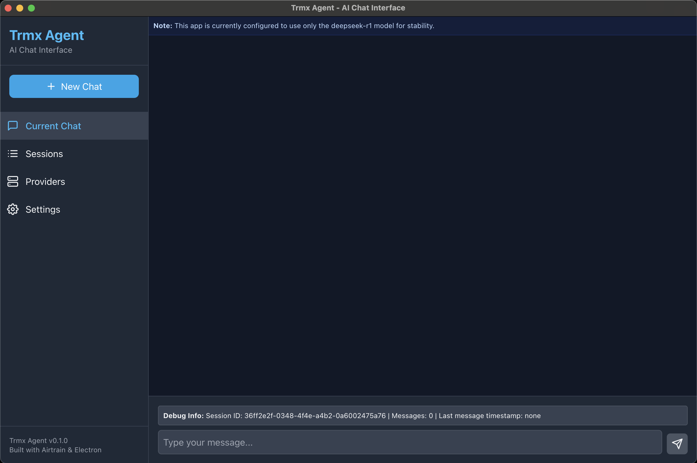
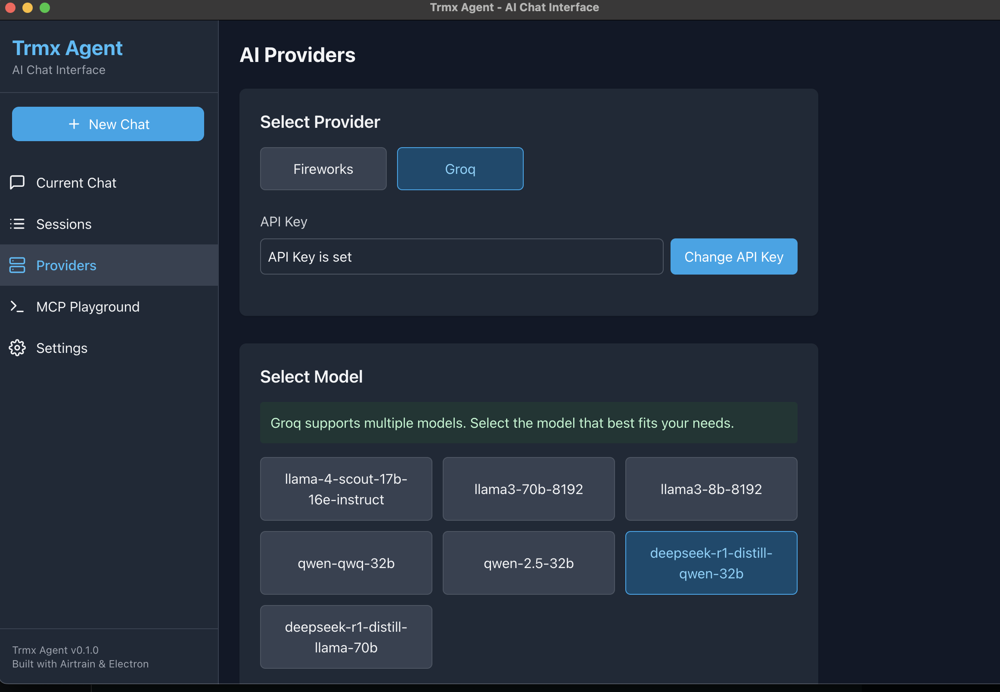
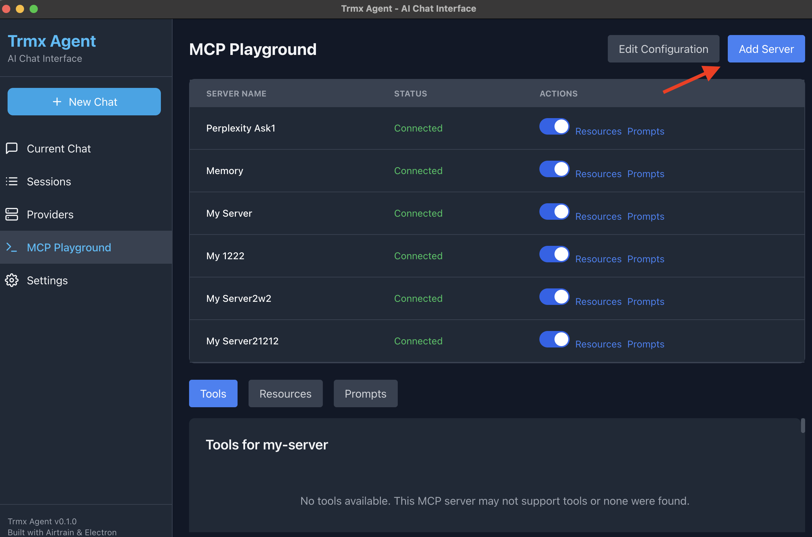
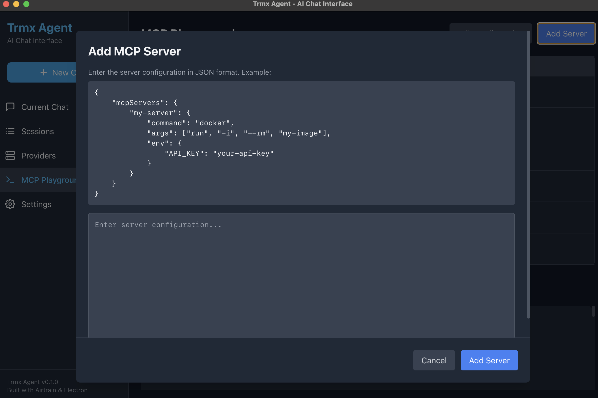

# MCP Playground - Postman for Model Context Protocol

A powerful desktop tool for exploring, debugging, and interacting with Model Context Protocol (MCP) servers, with built-in LLM integration. Think of it as "Postman but for MCPs."



## What is Model Context Protocol (MCP)?

MCP is a standardized protocol that enables LLMs (Large Language Models) to discover and use external tools, resources, and prompts. This protocol allows for consistent interaction between AI models and various capabilities, creating more powerful AI applications.

You can read more about MCPs in this post

## What MCP Playground Does

MCP Playground helps developers:

- Debug and test MCP servers
- Connect multiple LLMs to MCP servers
- Visualize and inspect tool calls, resources, and prompts
- Load tools directly into supported LLM providers
- Run multiple server connections in parallel
- Log everything locally for detailed debugging

## Key Features

- **MCP Server Debugging**: Connect to any MCP server and explore its tools, resources, and prompts
- **Built-in LLM Integration**: Connect directly with several LLM providers:
  - Fireworks AI
  - Groq
  - (More providers coming soon)
- **Tool Exploration**: List and inspect all available tools from MCP servers
- **Resource & Prompt Discovery**: View resources and prompts provided by MCP servers
- **Multiple Parallel Connections**: Connect to multiple MCP servers simultaneously
- **Comprehensive Logging**: Detailed local logs of all operations and responses
- **Tool Integration**: Load MCP tools directly into supported LLMs
- **Modern Interface**: Clean, intuitive UI for easy interaction with MCPs

## Installation

### Prerequisites

- Node.js (v18 or higher)
- npm (v7 or higher)

### Installation Steps

```bash
# Clone the repository
git clone https://github.com/rosaboyle/mcp-playground.git

# Navigate to the project directory
cd mcp-playground

# Install dependencies
npm install

# Build the project
npm run build

# Start the application
npm start
```

## Usage Guide

### Setting Up API Keys

You can easily set up your API keys through the application's user interface:

1. Open the application and navigate to the "Providers" section
2. Click "Set API Key" for the provider you want to configure
3. Enter your API key in the dialog box and save



### Adding MCP Servers

To add a new MCP server through the user interface:

1. Navigate to "MCP Playground" in the application
2. Click "Add Server" and fill in the server details
3. Click "Save" to store the server configuration




## Adding New MCP Servers

To add a new MCP server:

1. Use the "Add Server" button in the MCP Playground section
2. Specify the server name, command, arguments, and environment variables
3. Save the configuration

## Development

```bash
# Start the application in development mode
npm run dev
```

### Testing

Run the test suite:

```bash
npm test
```

For detailed information on testing, see [TESTING.md](docs/TESTING.md).

## Integration Examples

### Fireworks AI Integration

MCP Playground allows Fireworks AI models to:
1. Discover available tools from MCP servers
2. Call these tools when appropriate
3. Process the results from tool calls
4. Generate coherent responses based on the tool outputs

For more details, see [FIREWORKS_MCP_INTEGRATION.md](docs/FIREWORKS_MCP_INTEGRATION.md).

### Groq Integration

The Groq integration enables:
- Initializing the Groq client with an API key
- Making real API calls to the Groq API
- Streaming chat completions from Groq AI models
- Forwarding events from the stream to the renderer process

For more details, see [GROQ_INTEGRATION.md](docs/GROQ_INTEGRATION.md).

## Use Cases

- **API Testing**: Debug and test your MCP server implementations
- **Tool Development**: Develop and test new tools for MCP servers
- **LLM Integration**: Test how different LLMs interact with MCP tools
- **Education**: Learn about the Model Context Protocol
- **Development**: Build applications that leverage MCP and LLMs

## Troubleshooting

### Common Issues

- **Connection Errors**: Ensure your MCP server is running and the command/args in mcp.json are correct
- **API Key Issues**: Verify that you've set the correct API keys in your .env file
- **Tool Call Failures**: Check the server logs for errors in tool implementation

For specific integration issues:
- See [FIREWORKS_INTEGRATION.md](docs/FIREWORKS_INTEGRATION.md) for Fireworks-specific help
- See [GROQ_INTEGRATION.md](docs/GROQ_INTEGRATION.md) for Groq-specific help

For a list of known issues and limitations, see [KNOWN_ISSUES.md](KNOWN_ISSUES.md).

### Command-Line Exploration

For advanced users or troubleshooting, you can also explore MCP servers via command line:

```bash
npm run mcp-client
```

This will:
- Connect to the configured MCP server
- List all available tools
- List all available resources
- List all available prompts

### Testing LLM Integrations via Command Line

The application supports testing various LLM providers with MCP servers via command line:

#### Fireworks AI + MCP

```bash
# Test the Fireworks MCP integration
npx ts-node src/test_fireworks_mcp.ts

# Run in interactive mode
npx ts-node src/test_fireworks_mcp.ts --interactive
```

#### Groq + MCP

```bash
# Test the Groq integration
npx ts-node src/test_groq.ts
```

## Contributing

Contributions are welcome! Please feel free to submit a Pull Request.

1. Fork the repository
2. Create your feature branch (`git checkout -b feature/amazing-feature`)
3. Commit your changes (`git commit -m 'Add some amazing feature'`)
4. Push to the branch (`git push origin feature/amazing-feature`)
5. Open a Pull Request

## License

MIT

## Acknowledgments

- Thanks to all contributors who have helped build and improve this tool
- Special thanks to the MCP community for developing and promoting this standard 